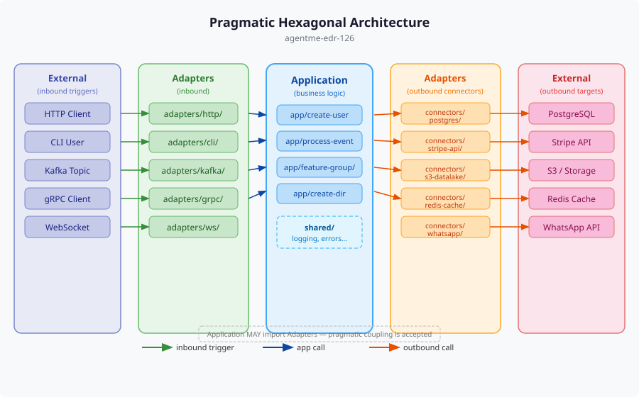

# agentme-edr-policy-126: Pragmatic hexagonal architecture

## Context and Problem Statement

Applications often mix business logic with infrastructure concerns (database access, HTTP handling, environment variable reading), making code hard to test, refactor, and reuse.

How should application source code be organized to separate business logic from infrastructure while avoiding unnecessary abstraction layers?

## Decision Outcome

**Organize application source code into three conceptual layers — External (not in codebase), Adapters (inbound/outbound I/O boundaries), and Application (business logic exposed as typed library interfaces) — following a pragmatic variant of Hexagonal Architecture that avoids unnecessary abstractions.**

### Details

#### 01-three-layer-separation

Every application MUST be organized into these three conceptual layers:

| Layer | Description |
|-------|-------------|
| **External** | Systems outside the codebase boundary (databases, third-party APIs, message brokers, filesystems, users) |
| **Adapters** | Bridge between External and Application — translate external protocols into application calls and vice versa |
| **Application** | Business logic that delegates I/O to adapters |



#### 02-adapter-naming-conventions

Adapters MUST follow these naming conventions:

**Inbound adapters** receive external requests or events and trigger application logic. Each gets a flat folder under `adapters/`:

- `cli/` — command-line interface entry point
- `http/` — HTTP/REST server
- `grpc/` — gRPC server
- `ws/` — WebSocket server
- `kafka/` — Kafka consumer
- `mqtt/` — MQTT subscriber
- Additional inbound adapters are allowed with descriptive names

**Outbound adapters** are called by the application to reach external systems. They live under `adapters/connectors/` with one subfolder per external resource, named descriptively:

- e.g.: `stripe-api/`, `config-file/`, `s3-datalake/`, `whatsapp/`, `postgres/`, `redis-cache/`

**Clarification:** "inbound" means the adapter triggers application logic in response to an external stimulus. "Outbound" means the application calls the adapter to interact with an external system.

#### 03-application-layer-rules

- Expose functionality as typed library interfaces
- All inputs MUST be explicitly passed as typed parameters
- No global variables, no direct environment variable access in `app/` or `shared/`
- Business logic with well-defined input/output behavior
- Group related logic into subfolders (aggregation roots)
- Environment variables MUST be read only in the bootstrap/entry-point layer of inbound adapters, converted into typed configuration objects, and passed explicitly to all other components

- Data flow examples

```text
HTTP request  →  adapters/http/     →  app/create-user     →  adapters/connectors/postgres/
CLI command   →  adapters/cli/      →  app/create-dir      →  adapters/connectors/local-fs/
Kafka message →  adapters/kafka/    →  app/process-event   →  adapters/connectors/stripe-api/
```

#### 04-mandatory-folder-structure

All projects MUST follow this folder structure:

```text
mysystem/
  Makefile             # targets to run different inbound interfaces (e.g. run-http, run-cli)
  src/
    adapters/          # mandatory
      cli/             # if CLI exists — bootstrap/entry point for CLI
      http/            # if HTTP server exists — bootstrap/entry point for HTTP
      grpc/            # if gRPC exists
      connectors/      # if external resource access exists
        postgres/      # one folder per external resource
        stripe-api/
    app/               # mandatory — core business logic
      feature1.ts
      feature-group/   # optional subfolders for grouping
    shared/            # utilities and functions shared among adapters and app
      logging.ts
      errors.ts
```

`shared/` must contain only infrastructure-agnostic utilities — not business rules or domain logic.

#### 05-pragmatic-coupling

- Application MAY import from Adapters when it simplifies the design
- Avoid excessive abstractions, interface types, and indirection layers
- Only introduce interfaces or abstract types when building a framework where the extra complexity demonstrably pays off
- Prefer concrete implementations over abstract ports — skip the purism of classic Hexagonal Architecture in favor of practicality
- Some coupling between Application and Adapters is acceptable and expected

#### 06-bootstrap-and-entry-points

- Each inbound adapter folder (`cli/`, `http/`, `grpc/`, etc.) MUST contain the bootstrap and entry point for that interface
- The project root Makefile MUST have targets to run the different inbound interfaces following [agentme-edr-303](../platform/303-common-targets.md) extension conventions (e.g. `run-http`, `run-grpc`)
- Bootstrap code lives in the adapter that receives inbound requests, not in a separate wiring layer

#### 07-minimum-complexity-threshold

- Trivial scripts and single-purpose tools (fewer than ~300 lines with a single I/O boundary) MAY skip this layering
- All other projects MUST use this structure from the start

#### 09-unit-testing-and-mocking-strategy

Unit tests for the `app/` layer MUST mock outbound adapter/connector interfaces at the `app/` → `adapters/connectors/` boundary. Inject connectors as constructor parameters or function arguments so tests can substitute them without touching real databases, HTTP APIs, or external services.

The connector implementations themselves SHOULD have their own unit tests that mock the underlying SDK or HTTP client.

```python
# Good — inject connector; unit test mocks it
class OrderService:
    def __init__(self, db: OrderRepository):
        self.db = db

def test_create_order_persists_record():
    fake_db = FakeOrderRepository()
    service = OrderService(db=fake_db)
    order = service.create({"item": "widget", "qty": 2})
    assert fake_db.find(order.id) is not None
```

Inbound adapters (`cli/`, `http/`, `grpc/`) are entry points and do not need to be mocked — test the `app/` layer directly by injecting fakes for its outbound connectors. See rule `10` for the naming and placement convention for shared mock files.

#### 10-mock-file-strategy

When a mock implementation needs to be **reused across multiple tests or imported by an eval script** (e.g. `eval.py` using `mock_fixtures` from [agentme-edr-152](152-ai-test-types-taxonomy.md) rule `02`), define it in a dedicated `_mock` file rather than inline.

**When to use a `_mock` file vs inline:**
- Single-test use → define the mock inline inside the test file (per rule `09` example; no file needed)
- Reusable across multiple tests OR used from `eval.py` → define in a separate `_mock` file

**Scope:** applies to any source file in `adapters/connectors/`, `app/`, or `shared/`. MUST NOT be used for inbound adapters (`cli/`, `http/`, `grpc/`) — those are entry points and MUST NOT be mocked (rule `09`).

**Naming:** insert `_mock` immediately before the file extension:

| Source file | Mock file |
|---|---|
| `client.py` | `client_mock.py` |
| `order_service.ts` | `order_service_mock.ts` |
| `user_store.go` | `user_store_mock_test.go` |

**Placement:** follows the project's test file placement convention per [agentme-edr-122](122-unit-test-requirements.md) rule `04`:
- Co-located test convention (TypeScript, Go) → mock file in the same directory as the source file
- Separate test folder convention (Python) → mock file mirrors the source path under the test folder (e.g. `lib/src/<pkg>/adapters/connectors/user-db/client.py` → `lib/tests/<pkg>/adapters/connectors/user-db/client_mock.py`)

**Mock contract:**
- MUST accept a `fixtures` parameter (constructor argument or factory function argument); the value is whatever `mock_fixtures[key]` contains from the dataset entry — its internal structure is opaque and interpreted by the mock implementation
- MUST NOT fall back to real external calls under any circumstance — if a call cannot be satisfied from the provided fixtures, MUST raise an explicit error (MUST NOT silently return `null`, `undefined`, or an empty value)

## References

- [agentme-edr-016](../principles/016-cross-language-module-structure.md) — Defines the module-root structure (Makefile, dist/, .cache/) that wraps this internal layout
- [agentme-edr-121](121-coding-best-practices.md) — File size limits and code organization practices that complement this architecture
- [agentme-edr-122](122-unit-test-requirements.md) — Rule `04`: test file placement convention per language (governs `_mock` file placement in rule `10`)
- [agentme-edr-152](152-ai-test-types-taxonomy.md) — Rule `02`: `mock_fixtures` golden dataset envelope that drives `_mock` usage in eval scripts
